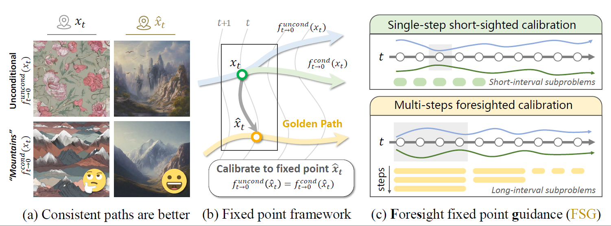

# Foresight Guidance (FSG)

[](https://neurips.cc/virtual/2025/loc/san-diego/poster/115124)
[](https://arxiv.org/abs/2510.21512)

Official implementation of **"Towards a Golden Classifier-Free Guidance Path via Foresight Fixed Point Iterations"**, accepted as a **Spotlight** paper at **NeurIPS 2025**.


## 📝 Abstract

Classifier-Free Guidance (CFG) is an essential component of text-to-image diffusion models, and understanding and advancing its operational mechanisms remains a central focus of research. Existing approaches stem from divergent theoretical interpretations, thereby limiting the design space and obscuring key design choices. To address this, we propose a unified perspective that reframes conditional guidance as fixed point iterations, seeking to identify a *golden path* where latents produce consistent outputs under both conditional and unconditional generation. We demonstrate that CFG and its variants constitute a special case of single-step short-interval iteration, which is theoretically proven to exhibit inefficiency. To this end, we introduce Foresight Guidance (FSG), which prioritizes solving longer-interval subproblems in early diffusion stages with increased iterations. Extensive experiments across diverse datasets and model architectures validate the superiority of FSG over state-of-the-art methods in both image quality and computational efficiency. Our work offers novel perspectives for conditional guidance and unlocks the potential of adaptive design.

## 🎯 Key Contributions

We propose a unified fixed point iteration framework to understand and improve Classifier-Free Guidance (CFG) in text-to-image diffusion models:

- **Unified Perspective**: Unifies CFG and its variants (CFG++, Z-Sampling, Resampling) under a fixed point iteration framework

- **Upgrading Existing Methods:** We can upgrade the existing CFG and CFG++ to CFG/CFG++ $\times K$ by increasing the number of fixed-point iterations.

- **Foresight Guidance (FSG)**: Achieves superior image quality and computational efficiency by prioritizing longer-interval subproblems in early diffusion stages with increased iterations

<div align="center">
  
  <p><em>From left to right: (a) Golden path illustration (b) Unified fixed point iteration framework (c) Foresight Guidance</em></p>
</div>

## 🚀 Quick Start

### Installation

```bash
# Clone the repository
git clone https://github.com/Ka1b0/Foresight-Guidance.git
cd Foresight-Guidance

# Create environment and install dependencies
conda create -n fsg python=3.10
conda activate fsg
pip install -r requirements.txt
```

### Basic Usage

```bash
# Generate images with NFE=50 configuration
python infer.py --nfe 50

# Generate with NFE=100 configuration
python infer.py --nfe 100

# Generate with NFE=150 configuration
python infer.py --nfe 150

```

## 📊 Experimental Results

### Main Results (SDXL Model)

| Method | NFE | DrawBench IR↑ | DrawBench HPSv2↑ | Pick-a-Pic IR↑ | Pick-a-Pic HPSv2↑ |
|--------|-----|---------------|------------------|----------------|-------------------|
| CFG | 50 | 59.02 | 28.73 | 82.14 | 28.46 |
| CFG++ | 50 | 65.21 | 28.98 | 89.75 | 28.72 |
| Z-Sampling | 50 | 72.75 | 29.08 | 96.77 | 28.68 |
| **FSG (ours)** | 50 | **82.81** | **29.42** | **98.59** | **28.89** |

FSG achieves state-of-the-art performance across all NFE settings (50/100/150). See paper for complete results.

### Key Advantages

✨ **Better Alignment**: Significant improvements in IR and HPSv2 metrics  
⚡ **Higher Efficiency**: Superior performance at low NFE budgets  

## 📖 Citation

If you find this work helpful, please cite our paper:

```bibtex
@inproceedings{wang2025foresight,
  title={Towards a Golden Classifier-Free Guidance Path via Foresight Fixed Point Iterations},
  author={Wang, Kaibo and Mao, Jianda and Wu, Tong and Xiang, Yang},
  booktitle={Advances in Neural Information Processing Systems},
  year={2025}
}
```

## 📄 License

This project is licensed under the MIT License. See the [LICENSE](LICENSE) file for details.

---

<div align="center">
  <b>⭐ If you find this project useful, please give us a star! ⭐</b>
</div>

